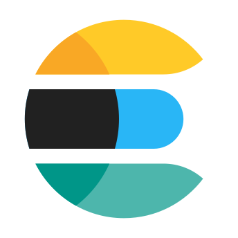

# My Learnings

This single repo contains some of the little projects I've made while learning some tools, frameworks or technologies. The idea came late so a lot of things I made are not featured here and they're lost or in other repos. I'm planning on moving some of those low value other repos inside of this one.

* [Bank](./go_bank/). (   ) Simple Bank API with HTTP and GRPC APIs made using Go, Gin, Postgres, SQLC, Redis and Asynq. First contact with the language.
* [Cards](./elixir_cards/). () Series of Elixir functions to generate and use a deck of cards. Extremely basic project as a first approach to the language.
* [Discuss](./elixir_discuss/). ( ) Discussion forum with GitHub authentication built with Elixir on top of Phoenix. It has a REST API, Websocket communications and a server-side rendered frontend.
* [Empathy Search Path](./empathy_academy_search_path_module/). (  ) Project from my time as an Academy Fellow in my first days at Empathy.co. Search engine made in Micronaut over ElasticSearch.
* [Identicon](./elixir_identicon/). () Basic identicon generator made with Elixir.
* [Invaders](./rust_invaders/) () Command-line of Space Invaders clone made with pure Rust.
* [Pet Clinic](./spring_pet_clinic/) ( ) Implementation with Kotlin and Spring 5 of the Pet Clinic sample application. _Unfinished_.
* [Wikimedia to OpenSearch](./java_kafka) (  ) Kafka project to poll data from Wikimedia, calculate stats and index it into OpenSearch. It also contains some Kafka demos.

## Technology index

*  Apache Kafka
*  Elastic Search
*  Elixir
*  Go
*  gRPC
*  Java
*  Kotlin
*  Micronaut
*  OpenSearch
*  Phoenix
*  PostgreSQL
*  Redis
*  Rust
*  Spring
